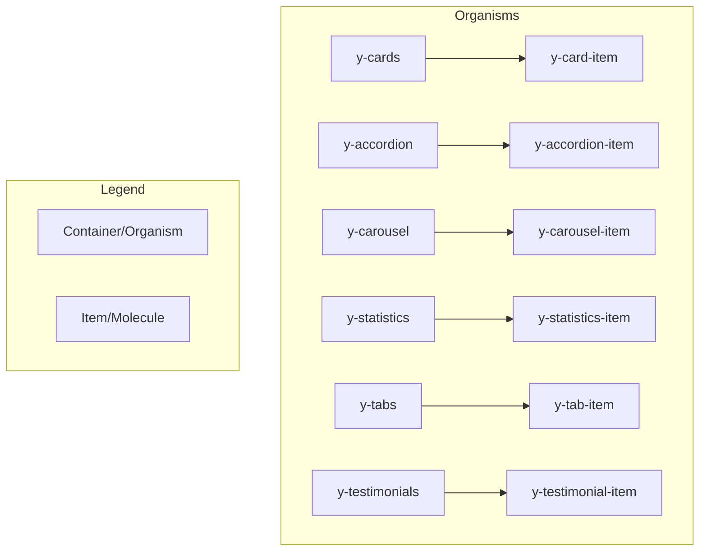

# YMCA Website Services + Canvas Demo

> **POC environment for converting YMCA Website Services Layout Builder components to Canvas SDC (Single Directory Components)**

[](https://www.drupal.org)
[](https://www.drupal.org/project/canvas)
[](#canvas-organisms)

---

## Table of Contents

- [Quick Start](#quick-start)
- [Environment Details](#environment-details)
- [Canvas Organisms](#canvas-organisms)
- [Atomic Design Pattern](#atomic-design-pattern)
- [Slot Restrictions](#slot-restrictions)
- [Canvas Module Enhancements](#canvas-module-enhancements)
- [Adding New Components](#adding-new-components)
- [URLs](#urls)

---

## Quick Start

```bash
git clone git@github.com:ITCare-Company/ymca_ws_canvas_demo.git
cd ymca_ws_canvas_demo
ddev start
ddev drush uli
```

<details>
<summary><strong>Login Credentials</strong></summary>

| Username | Password |
|----------|----------|
| `admin`  | `admin123` |

</details>

---

## Environment Details

| Component | Version | Branch |
|-----------|---------|--------|
| **Drupal** | 11.3.0-rc1 | - |
| **Canvas** | 1.0.0-rc5 | Modified with slot restrictions |
| **YMCA WS** | dev | `feature/drupal-11.3-support` |
| **y_lb** | dev | `fix/drupal-11.3-compatibility` |

---

## Canvas Organisms

**60 SDC Components** converted from YMCA Website Services Layout Builder blocks.

Located in: `docroot/themes/custom/y_canvas/components/organisms/`

### Component Categories

<details>
<summary><strong>Content Blocks (12)</strong></summary>

| Component | Description | Has Slots |
|-----------|-------------|:---------:|
| `y-accordion` | Expandable FAQ sections | ✅ |
| `y-basic-block` | Simple content block | - |
| `y-code-block` | Code/embed display | - |
| `y-date-block` | Date range display | - |
| `y-flexible-content` | WYSIWYG content | - |
| `y-modal` | Modal dialog | - |
| `y-promo` | Promotional banner | - |
| `y-simple-block` | Minimal content block | - |
| `y-table` | Data tables | - |
| `y-webform` | Form embedding | - |
| `y-search-results` | Search results display | - |
| `y-map` | Location map | - |

</details>

<details>
<summary><strong>Cards & Grids (8)</strong></summary>

| Component | Description | Has Slots |
|-----------|-------------|:---------:|
| `y-cards` | Card grid container | ✅ |
| `y-card-item` | Individual card (Molecule) | - |
| `y-grid-cta` | CTA grid container | ✅ |
| `y-grid-item` | Grid item (Molecule) | - |
| `y-icon-grid` | Icon grid container | ✅ |
| `y-icon-grid-item` | Icon grid item (Molecule) | - |
| `y-featured-highlights` | Featured content grid | - |
| `y-ping-pong` | Alternating content rows | - |

</details>

<details>
<summary><strong>Hero & Banners (4)</strong></summary>

| Component | Description | Has Slots |
|-----------|-------------|:---------:|
| `y-hero` | Hero banner with variations | - |
| `y-carousel` | Image/content carousel | ✅ |
| `y-carousel-item` | Carousel slide (Molecule) | - |
| `y-donate` | Donation CTA with amounts | ✅ |

</details>

<details>
<summary><strong>Navigation & Menus (5)</strong></summary>

| Component | Description | Has Slots |
|-----------|-------------|:---------:|
| `y-menu-block` | Menu display | - |
| `y-menu-cta` | Menu with CTA | - |
| `y-simple-menu` | Simple icon menu | - |
| `y-camp-menu` | Camp navigation | - |
| `y-camp-quick-links` | Quick link buttons | - |

</details>

<details>
<summary><strong>Articles & Events (8)</strong></summary>

| Component | Description | Has Slots |
|-----------|-------------|:---------:|
| `y-articles-listing` | Article list with filters | - |
| `y-articles-filter` | Article filter controls | - |
| `y-featured-articles` | Featured article cards | - |
| `y-related-articles` | Related articles section | - |
| `y-events-listing` | Event list with filters | - |
| `y-events-filter` | Event filter controls | - |
| `y-featured-events` | Featured event cards | - |
| `y-related-events` | Related events section | - |

</details>

<details>
<summary><strong>Statistics & Testimonials (8)</strong></summary>

| Component | Description | Has Slots |
|-----------|-------------|:---------:|
| `y-statistics` | Stats with background | ✅ |
| `y-statistics-item` | Stat item (Molecule) | - |
| `y-small-statistics` | Compact stats | ✅ |
| `y-small-statistics-item` | Small stat (Molecule) | - |
| `y-testimonials` | Testimonial carousel | ✅ |
| `y-testimonial-item` | Testimonial card (Molecule) | - |
| `y-staff-members` | Staff grid | ✅ |
| `y-staff-member-item` | Staff card (Molecule) | - |

</details>

<details>
<summary><strong>Partners & Tabs (6)</strong></summary>

| Component | Description | Has Slots |
|-----------|-------------|:---------:|
| `y-partners` | Partner logos | - |
| `y-partners-tier` | Tiered partners | ✅ |
| `y-partner-item` | Partner logo (Molecule) | - |
| `y-tabs` | Tabbed content | ✅ |
| `y-tab-item` | Tab panel (Molecule) | - |
| `y-activity-finder` | Program search | - |

</details>

<details>
<summary><strong>Branch & Location (9)</strong></summary>

| Component | Description | Has Slots |
|-----------|-------------|:---------:|
| `y-branch-amenities` | Amenities list | - |
| `y-branch-amenities-legacy` | Legacy amenities | - |
| `y-branch-hours` | Operating hours | - |
| `y-branch-social` | Social media links | - |
| `y-simple-schedule` | Schedule display | - |
| `y-repeat-schedules` | Recurring schedules | - |
| `y-ping-pong-section` | Section wrapper | - |
| `y-accordion-item` | Accordion panel (Molecule) | - |
| `y-donate-item` | Donation amount (Molecule) | - |

</details>

---

## Atomic Design Pattern

Components follow **Atomic Design** principles with parent-child relationships:



### Parent → Child Mappings

| Parent (Container) | Child (Item) | Slot Name |
|-------------------|--------------|-----------|
| `y-accordion` | `y-accordion-item` | `items` |
| `y-cards` | `y-card-item` | `items` |
| `y-carousel` | `y-carousel-item` | `slides` |
| `y-donate` | `y-donate-item` | `amounts` |
| `y-grid-cta` | `y-grid-item` | `items` |
| `y-icon-grid` | `y-icon-grid-item` | `items` |
| `y-partners-tier` | `y-partner-item` | `partners` |
| `y-small-statistics` | `y-small-statistics-item` | `items` |
| `y-staff-members` | `y-staff-member-item` | `members` |
| `y-statistics` | `y-statistics-item` | `items` |
| `y-tabs` | `y-tab-item` | `tabs` |
| `y-testimonials` | `y-testimonial-item` | `items` |

---

## Slot Restrictions

Canvas has been enhanced with **slot restrictions** using `allowedComponents`:

### How It Works

```yaml
# y-cards.component.yml
slots:
  items:
    title: Card Items
    description: Add cards to this section
    allowedComponents:
      - sdc.y_canvas.y-card-item  # Only y-card-item can be dropped here
```

### Features

| Feature | Description |
|---------|-------------|
| **Drag Validation** | Only allowed components can be dropped into slots |
| **Hierarchical Library** | Child components appear nested under parents |
| **Visual Feedback** | Drop zones show allowed/disallowed state |
| **Slot Filtering** | Library filters to show only compatible components |

### Canvas UI Enhancements

```
┌─────────────────────────────────┐
│ Components                      │
├─────────────────────────────────┤
│ 📁 Organisms                    │
│   ▶ Y Accordion                 │
│       └─ Y Accordion Item       │  ← Nested under parent
│   ▶ Y Cards                     │
│       └─ Y Card Item            │
│   ▶ Y Carousel                  │
│       └─ Y Carousel Item        │
│     Y Hero                      │  ← No children
│     Y Promo                     │
└─────────────────────────────────┘
```

---

## Canvas Module Enhancements

Custom hooks and components added to Canvas UI:

### New Hooks

| Hook | Purpose |
|------|---------|
| `useComponentHierarchy` | Builds parent-child tree from `allowedComponents` |
| `useIsDropAllowed` | Validates drops against slot restrictions |
| `useSlotFilteredComponents` | Filters library when targeting specific slots |

### Modified Components

| Component | Changes |
|-----------|---------|
| `ComponentList.tsx` | Hierarchical display with collapsible children |
| `HierarchicalListItem.tsx` | New component for nested items |
| `EmptySlotDropZone.tsx` | Drop validation integration |
| `ComponentDropZone.tsx` | Restriction checking on drag |
| `PreviewOverlay.module.css` | Improved slot label fitting |

### Schema Extensions

```yaml
# canvas.schema.yml - Added allowedComponents support
canvas.slots.slot:
  type: mapping
  mapping:
    allowedComponents:
      type: sequence
      sequence:
        type: string
```

---

## Adding New Components

### 1. Create Component Directory

```bash
mkdir -p docroot/themes/custom/y_canvas/components/organisms/y-{name}
```

### 2. Add Required Files

```
y-{name}/
├── y-{name}.component.yml  # Schema definition
├── y-{name}.twig           # Template
└── y-{name}.css            # Styles
```

### 3. Component Schema Template

```yaml
'$schema': 'https://git.drupalcode.org/project/drupal/-/raw/HEAD/core/assets/schemas/v1/metadata.schema.json'

name: Y Component Name
description: Component description
status: experimental
group: Organisms

props:
  type: object
  properties:
    title:
      type: string
      title: Heading
      examples:
        - 'Example Title'

# For container components with child items:
slots:
  items:
    title: Items
    allowedComponents:
      - sdc.y_canvas.y-item-component

libraryOverrides:
  dependencies:
    - y_canvas/y-{name}
```

### 4. Register Library

Add to `y_canvas.libraries.yml`:

```yaml
y-{name}:
  css:
    component:
      components/organisms/y-{name}/y-{name}.css: {}
```

### 5. Clear Cache

```bash
ddev drush cr
```

---

## URLs

| Page | URL |
|------|-----|
| **Site Home** | https://ymca-canvas-poc.ddev.site |
| **Canvas Editor** | `/canvas/editor/canvas_page/{id}` |
| **Add Canvas Page** | `/admin/content/pages/add` |
| **Component Admin** | `/admin/appearance/component` |
| **Content Admin** | `/admin/content` |

---

## Recent Changes

<details>
<summary><strong>December 2024 Updates</strong></summary>

### Week of Dec 9-15

- **60 Canvas SDC Organisms** - Full conversion from Layout Builder
- **Slot Restrictions** - `allowedComponents` support in Canvas
- **Hierarchical Library** - Nested component display
- **Atomic Design** - 12 parent-child component pairs
- **Demo Images** - Local YMCA images replacing placeholders
- **UI Fixes** - Drop zone text fitting, list alignment

### Key Commits

| Commit | Description |
|--------|-------------|
| `feat: Add slot restrictions` | Canvas schema + UI for `allowedComponents` |
| `feat: Implement Atomic Design` | Parent-child component relationships |
| `feat: Replace placeholder URLs` | Local demo images from small-y |
| `fix: Slot drop zone text` | Improved fitting with container queries |
| `fix: Hierarchical list alignment` | Consistent spacing for chevrons |

</details>

---

## License

This project is part of [YMCA Website Services](https://github.com/YCloudYUSA/y_lb).
