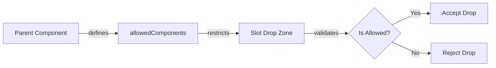
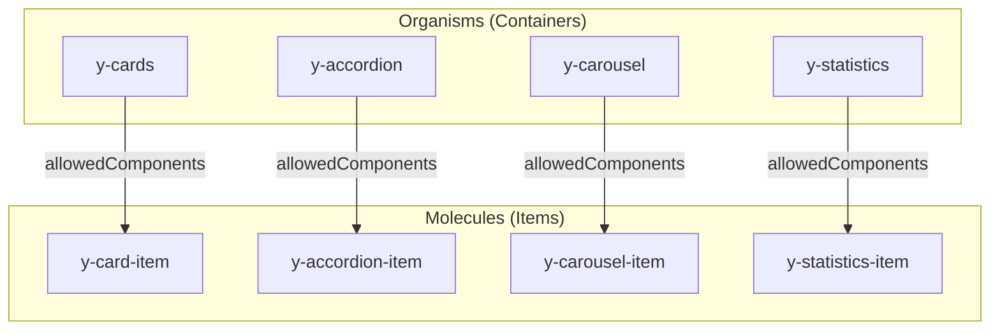

# Canvas Slot Restrictions Demo

> **Demonstration of `allowedComponents` slot restrictions for Drupal Canvas module**

[](https://www.drupal.org)
[](https://www.drupal.org/project/canvas)
[](#canvas-organisms)
[](https://www.drupal.org/project/canvas/issues/3563163)

---

## Demo Video

[](https://youtu.be/QT4cPzMBTr4)

**[Watch Demo on YouTube →](https://youtu.be/QT4cPzMBTr4)**

---

## Related Links

| Resource | URL |
|----------|-----|
| **Drupal.org Issue** | [#3563163 - Add slot allowedComponents UI support](https://www.drupal.org/project/canvas/issues/3563163) |
| **Issue Fork Branch** | [git.drupalcode.org/issue/canvas-3563163](https://git.drupalcode.org/issue/canvas-3563163/-/tree/3563163-feat-add-slot) |
| **Demo Video** | [youtu.be/QT4cPzMBTr4](https://youtu.be/QT4cPzMBTr4) |
| **Canvas Module** | [drupal.org/project/canvas](https://www.drupal.org/project/canvas) |

---

## Table of Contents

- [Overview](#overview)
- [Quick Start](#quick-start)
- [Slot Restrictions Feature](#slot-restrictions-feature)
- [Canvas Organisms](#canvas-organisms)
- [Atomic Design Pattern](#atomic-design-pattern)
- [Canvas UI Changes](#canvas-ui-changes)

---

## Overview

This repository demonstrates the **slot restrictions** feature proposed for Drupal Canvas, allowing SDC components to define which child components can be placed in their slots using `allowedComponents`.

### Problem

Canvas slots currently accept any component. For Atomic Design patterns where Organisms contain specific Molecules (e.g., Accordion → Accordion Items), there's no way to enforce these relationships.

### Solution

```yaml
# Example: y-cards.component.yml
slots:
  items:
    title: Card Items
    allowedComponents:
      - sdc.y_canvas.y-card-item  # Only card items can be dropped here
```

---

## Quick Start

```bash
git clone https://github.com/ITCare-Company/ymca_ws_canvas_demo_public.git
cd ymca_ws_canvas_demo_public
ddev start
ddev drush uli
```

<details>
<summary><strong>Environment Details</strong></summary>

| Component | Version |
|-----------|---------|
| **Drupal** | 11.3.0-rc1 |
| **Canvas** | 1.0.0-rc5 (with slot restrictions patch) |
| **DDEV** | Required for local development |

</details>

---

## Slot Restrictions Feature

### How It Works



### Features

| Feature | Description |
|---------|-------------|
| **Drag Validation** | Only allowed components can be dropped into slots |
| **Hierarchical Library** | Child components appear nested under parents |
| **Visual Feedback** | Drop zones indicate allowed/disallowed state |
| **Slot Filtering** | Library filters to show only compatible components |

### UI Visualization

```
┌─────────────────────────────────┐
│ Components                      │
├─────────────────────────────────┤
│ 📁 Organisms                    │
│   ▶ Y Accordion                 │
│       └─ Y Accordion Item       │  ← Nested under parent
│   ▶ Y Cards                     │
│       └─ Y Card Item            │
│   ▶ Y Carousel                  │
│       └─ Y Carousel Item        │
│     Y Hero                      │  ← No children (flat)
│     Y Promo                     │
└─────────────────────────────────┘
```

---

## Canvas Organisms

**60 SDC Components** demonstrating slot restrictions with Atomic Design patterns.

Located in: `docroot/themes/custom/y_canvas/components/`

<details>
<summary><strong>Components with Slot Restrictions (12 pairs)</strong></summary>

| Parent (Organism) | Child (Molecule) | Slot Name |
|-------------------|------------------|-----------|
| `y-accordion` | `y-accordion-item` | `items` |
| `y-cards` | `y-card-item` | `items` |
| `y-carousel` | `y-carousel-item` | `slides` |
| `y-donate` | `y-donate-item` | `amounts` |
| `y-grid-cta` | `y-grid-item` | `items` |
| `y-icon-grid` | `y-icon-grid-item` | `items` |
| `y-partners-tier` | `y-partner-item` | `partners` |
| `y-small-statistics` | `y-small-statistics-item` | `items` |
| `y-staff-members` | `y-staff-member-item` | `members` |
| `y-statistics` | `y-statistics-item` | `items` |
| `y-tabs` | `y-tab-item` | `tabs` |
| `y-testimonials` | `y-testimonial-item` | `items` |

</details>

<details>
<summary><strong>All Component Categories</strong></summary>

- **Content Blocks** (12): Accordion, Basic Block, Code, Flexible Content, Modal, Promo, etc.
- **Cards & Grids** (8): Cards, Grid CTA, Icon Grid, Featured Highlights, Ping Pong
- **Hero & Banners** (4): Hero, Carousel, Donate
- **Navigation** (5): Menu Block, Menu CTA, Simple Menu, Camp Menu
- **Articles & Events** (8): Listings, Filters, Featured, Related
- **Statistics & Testimonials** (8): Statistics, Small Statistics, Staff Members, Testimonials
- **Partners & Tabs** (6): Partners, Partners Tier, Tabs, Activity Finder
- **Branch & Location** (9): Amenities, Hours, Social, Schedules

</details>

---

## Atomic Design Pattern



---

## Canvas UI Changes

Files modified/added for slot restrictions support:

### New Hooks

| File | Purpose |
|------|---------|
| `useComponentHierarchy.ts` | Builds parent-child tree from `allowedComponents` |
| `useIsDropAllowed.ts` | Validates drops against slot restrictions |
| `useSlotFilteredComponents.ts` | Filters library when targeting specific slots |

### Modified Components

| File | Changes |
|------|---------|
| `ComponentList.tsx` | Hierarchical display with collapsible children |
| `HierarchicalListItem.tsx` | New component for nested items |
| `List.module.css` | Chevron and indent styling |
| `PreviewOverlay.module.css` | Improved empty slot text handling |
| `uiSlice.ts` | Added `TargetSlotInfo` state |

---

## Contributing

This demo supports the Canvas issue:

**[drupal.org/project/canvas/issues/3563163](https://www.drupal.org/project/canvas/issues/3563163)**

To test the patch:
1. Clone this repository
2. Run `ddev start`
3. Create Canvas pages and test slot restrictions

---

## License

This project uses components from [YMCA Website Services](https://github.com/YCloudYUSA/y_lb) for demonstration purposes.
