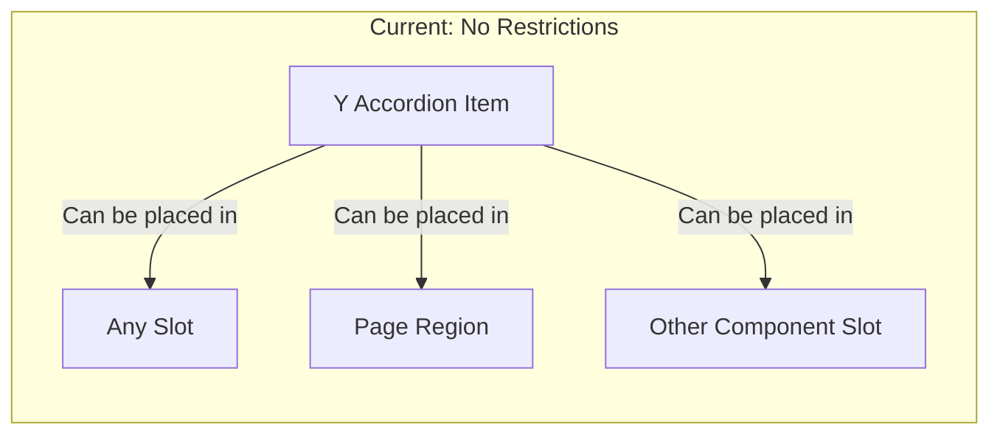
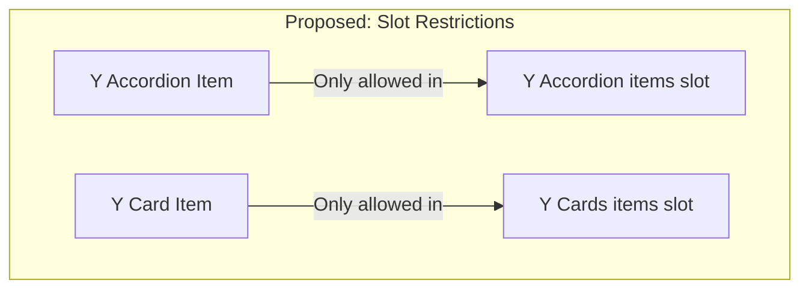

# Canvas Slot Restrictions Implementation Plan

> [!NOTE]
> This document outlines research findings and implementation plan for restricting item components to their parent organism slots in Drupal Canvas.

## Problem Statement

Currently, all YMCA Canvas SDC components appear in a flat list in the Canvas Library UI. Item components (e.g., `Y Accordion Item`) can be placed **anywhere** - including outside their intended parent containers. This leads to:

- Content editor confusion
- Invalid component placements
- Broken layouts when items are placed outside parent context



## Solution Overview

### Phase 1: Atomic Design Categorization (Completed)

Reorganize components following Canvas's Atomic Design pattern:

| Category | Purpose | Count |
|----------|---------|-------|
| **Molecules** | Item components that compose into organisms | 12 |
| **Organisms** | Complete sections with slots for molecules | 37 |

<details>
<summary>Component Mapping (12 Molecules)</summary>

| Molecule | Parent Organism | Slot Name |
|----------|-----------------|-----------|
| `y-accordion-item` | `y-accordion` | `items` |
| `y-card-item` | `y-cards` | `items` |
| `y-carousel-item` | `y-carousel` | `slides` |
| `y-donate-item` | `y-donate` | `items` |
| `y-grid-item` | `y-grid-cta` | `items` |
| `y-icon-grid-item` | `y-icon-grid` | `items` |
| `y-partner-item` | `y-partners-tier` | `partners` |
| `y-small-statistics-item` | `y-small-statistics` | `items` |
| `y-staff-member-item` | `y-staff-members` | `members` |
| `y-statistics-item` | `y-statistics` | `items` |
| `y-tab-item` | `y-tabs` | `items` |
| `y-testimonial-item` | `y-testimonials` | `items` |

</details>

### Phase 2: Slot Restrictions (Proposed)

> [!IMPORTANT]
> This requires modifications to the Canvas module itself.



## Technical Research Findings

### Canvas Architecture Analysis

#### 1. Current Slot Metadata Flow

```
┌─────────────────────────────────────────────────────────────────┐
│ component.yml (SDC Definition)                                  │
│   slots:                                                        │
│     items:                                                      │
│       title: "Items"                                            │
│       # No allowedComponents - accepts ANY component            │
└─────────────────────────────────────────────────────────────────┘
                              ↓
┌─────────────────────────────────────────────────────────────────┐
│ PHP: ComponentSourceWithSlotsInterface::getSlotDefinitions()    │
│   Returns: array<string, array{                                 │
│     'title': string,                                            │
│     'description'?: string                                      │
│   }>                                                            │
└─────────────────────────────────────────────────────────────────┘
                              ↓
┌─────────────────────────────────────────────────────────────────┐
│ React: Component.metadata.slots                                 │
│   { [slotName]: { title: string } }                             │
│   # No filtering capability                                     │
└─────────────────────────────────────────────────────────────────┘
```

#### 2. Library Rendering Flow

```typescript
// Current: No slot context awareness
Library.tsx
  └── ComponentList.tsx
      └── useGetComponentsQuery()  // Fetches ALL components
      └── LibraryItemList.tsx      // Shows ALL components
```

#### 3. Drag & Drop Context

Canvas **does** track the target slot during drag operations:

```typescript
// DragEventsHandler.tsx (lines 104-113)
const parentSlot = event.over?.data?.current?.parentSlot;
if (parentSlot) {
  dispatch(setTargetSlot(parentSlot.id));  // Redux state available
}
```

### Key Finding

> [!WARNING]
> Canvas has the infrastructure to know **which slot** is being edited, but the Library component **does not use this information** to filter components.

## Implementation Plan

### Required Changes

#### 1. Schema Extension (`canvas.schema.yml`)

```yaml
# Add to slot definition schema
canvas.slot_definition:
  type: mapping
  mapping:
    title:
      type: label
      label: 'Title'
    description:
      type: text
      label: 'Description'
    allowedComponents:              # NEW
      type: sequence
      label: 'Allowed Components'
      sequence:
        type: string
```

#### 2. PHP Interface Update

```php
// ComponentSourceWithSlotsInterface.php
public function getSlotDefinitions(): array;
// Returns: array<string, array{
//   'title': string,
//   'description'?: string,
//   'allowedComponents'?: string[]  // NEW
// }>
```

#### 3. TypeScript Types

```typescript
// Component.ts
interface SlotDefinition {
  title: string;
  description?: string;
  allowedComponents?: string[];  // NEW
}
```

#### 4. Library Filtering Hook

```typescript
// useSlotFilteredComponents.ts (NEW)
export function useSlotFilteredComponents(
  components: Component[],
  targetSlot?: SlotNode
): Component[] {
  return useMemo(() => {
    if (!targetSlot?.allowedComponents?.length) {
      return components;  // No restriction
    }
    return components.filter(c =>
      targetSlot.allowedComponents.includes(c.id)
    );
  }, [components, targetSlot]);
}
```

#### 5. Component YAML Updates

```yaml
# y-accordion.component.yml
slots:
  items:
    title: Accordion Items
    allowedComponents:
      - y_canvas:y-accordion-item
```

### Files to Modify

| File | Module | Change Type |
|------|--------|-------------|
| `canvas.schema.yml` | canvas | Schema extension |
| `ComponentSourceWithSlotsInterface.php` | canvas | Interface update |
| `GeneratedFieldExplicitInputUxComponentSourceBase.php` | canvas | Pass allowedComponents |
| `Component.ts` | canvas/ui | TypeScript types |
| `Library.tsx` | canvas/ui | Add slot context |
| `LibraryItemList.tsx` | canvas/ui | Apply filtering |
| 12 parent `*.component.yml` | y_canvas theme | Add slot restrictions |

## Next Steps

1. [ ] Create issue in Canvas module for `allowedComponents` feature
2. [ ] Fork Canvas module or create patch
3. [ ] Implement PHP schema/interface changes
4. [ ] Implement React filtering logic
5. [ ] Update YMCA parent components with slot restrictions
6. [ ] Test end-to-end slot restriction behavior

## References

- [Canvas Components Documentation](https://git.drupalcode.org/project/canvas/-/blob/HEAD/docs/components.md)
- [Canvas Module on Drupal.org](https://www.drupal.org/project/canvas)

> [!WARNING]
> Slot restriction feature (`allowedComponents`) does not exist in Canvas module yet. A feature request issue should be created on drupal.org/project/canvas to propose this enhancement.
